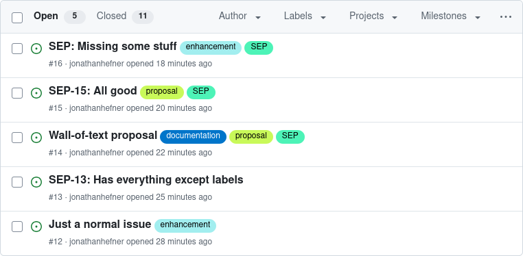
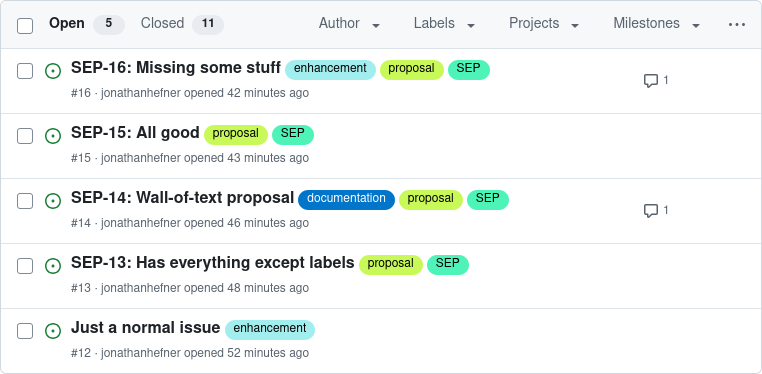
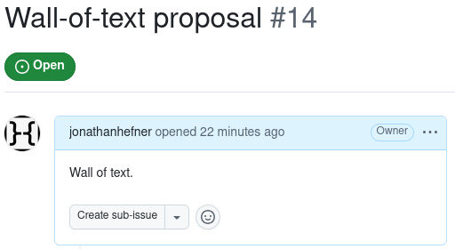
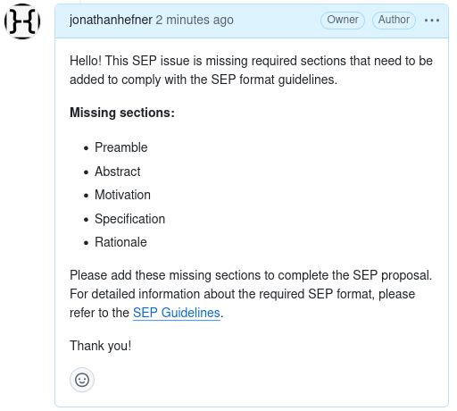

# `lint-seps` MCP Server

Recently the Model Context Protocol project [introduced a new process for proposing changes to the spec](https://blog.modelcontextprotocol.io/posts/2025-07-31-governance-for-mcp/).  The process is driven by Specification Enhancement Proposals, or SEPs.  SEPs are submitted as GitHub Issues to the MCP repository, and should follow the [SEP Guidelines](https://modelcontextprotocol.io/community/sep-guidelines).  Some of the guidelines pertain to the format of an SEP Issue, such as the [required body sections](https://modelcontextprotocol.io/community/sep-guidelines#sep-format) and [which Issue labels to apply](https://modelcontextprotocol.io/community/sep-guidelines#sep-workflow).

In this post, we will create an agentic workflow to lint SEP GitHub Issues and apply minor corrections to Issue titles and labels.

This post will assume some familiarity with TypeScript and [MCP server concepts](https://modelcontextprotocol.io/docs/learn/server-concepts).  We will use VS Code to test the agentic workflow, but the workflow should work with any agentic client application such as [Claude Code](https://www.anthropic.com/claude-code) or [Gemini CLI](https://github.com/google-gemini/gemini-cli).

The project source code for this post is [available on GitHub](https://github.com/jonathanhefner/lint-seps).  For quick-start boilerplate to build your own agentic worflow, check out the [`starter` branch of the project](https://github.com/jonathanhefner/lint-seps/tree/starter).


## Configuring VS Code

After installing the [official MCP TypeScript SDK](https://github.com/modelcontextprotocol/typescript-sdk) and setting up the project boilerplate, we will register our MCP server in VS Code.  While we are at it, we will also register the [official GitHub MCP server](https://github.com/github/github-mcp-server), which we will use later.

VS Code's documentation [discusses multiple ways to register an MCP server](https://code.visualstudio.com/docs/copilot/chat/mcp-servers#_add-an-mcp-server).  To keep things simple, we add both servers directly to [`.vscode/mcp.json`](./.vscode/mcp.json) in the project directory:

```json
{
  "servers": {
    "lint-seps": {
      "type": "stdio",
      "command": "npm",
      "args": ["run", "--silent", "dev"]
    },
    "github": {
      "url": "https://api.githubcopilot.com/mcp/"
    }
  }
}
```

This lets us test our server locally.  However, if you distribute your MCP server as an npm package, users will still need to register the server in their own client applications.


## Defining a Tool for Our Agent

Next, we will define an [MCP tool](https://modelcontextprotocol.io/specification/2025-06-18/server/tools), `generate_report_for_github_issue`, for our agent to use:

```ts
// src/index.ts

server.registerTool("generate_report_for_github_issue",
  {
    description: "Generates a report for a given GitHub Issue. If the Issue is an SEP Issue, the report will indicate problems that should be addressed, such as an improperly formatted title or missing labels.",
    inputSchema: {
      repositoryOwner: z.string(),
      repositoryName: z.string(),
      issueNumber: z.number(),
    },
  },
  async ({ repositoryOwner, repositoryName, issueNumber }) => ({
    content: [{ type: "text", text: await generateReport({ repositoryOwner, repositoryName, issueNumber }) }]
  })
);
```

Notice that `generate_report_for_github_issue` accepts an Issue number instead of the Issue data.  We could make the agent use a tool from GitHub's MCP server to fetch the Issue data and pass it to `generate_report_for_github_issue`, but that would fill the LLM's context window with the full data for Issue each we process.  To avoid polluting the context window, we will make the agent pass an Issue number, and we will use GitHub's REST API to fetch the Issue data ourselves.

To keep our code tidy, the `generate_report_for_github_issue` tool delegates to `generateReport()`, which lives in [`src/generateReport.ts`](./src/generateReport.ts).  As its name implies, `generateReport()` generates a report for our agent to act on:

```ts
// src/generateReport.ts

export async function generateReport(ref: GithubIssueRef): Promise<string> {
  const data = await fetchData(ref);

  if (data instanceof Error) {
    return `Could not fetch data for ${tagRef(ref)} due to ${tagError(data)}.`
  } else if (isSep(data)) {
    return generateReportForSep(ref, data);
  } else {
    return `${tagRef(ref)} is OK (not an SEP).`
  }
}

function generateReportForSep(ref: GithubIssueRef, { title, labels, body }: GithubIssueData): string {
  const problems: string[] = [];

  // Check title
  const correctedTitle = title.replace(/^(?:SEP[- ]?(\d+)?:?\s*)?/, (match, id) => {
    if (id === ref.issueNumber.toString()) {
      return match;
    } else if (id) {
      return `SEP-${ref.issueNumber}: ${match}`;
    } else {
      return `SEP-${ref.issueNumber}: `;
    }
  });
  if (title !== correctedTitle) {
    problems.push(`Title should be: ${tag("title", correctedTitle)}.`);
  }

  // Check labels
  const correctedLabels = labels.map(label => label.name);
  if (!sepStates.some((state) => correctedLabels.includes(state))) {
    correctedLabels.push("proposal");
  }
  if (!correctedLabels.includes("SEP")) {
    correctedLabels.push("SEP");
  }
  if (correctedLabels.length > labels.length) {
    problems.push(`Labels should be: ${tagAll("issue_labels", "label", correctedLabels)}.`);
  }

  // Check sections
  const headings = extractHeadings(body);
  const missingSections = sepRequiredSections.filter((section) => !headings.includes(section));
  if (missingSections.length > 0) {
    problems.push(`Sections are missing: ${tagAll("missing_sections", "section", missingSections)}.`);
  }

  if (problems.length === 0) {
    return `${tagRef(ref)} is OK.`
  } else {
    return `${tagRef(ref)} has the following problems: ${tagAll("problems", "problem", problems)}.`
  }
}
```

The generated report is written in natural language, but also incorporates XML tags that [help the agent interpret content](https://docs.anthropic.com/en/docs/build-with-claude/prompt-engineering/use-xml-tags).  Our `tag*()` helper functions make it easy to add the appropriate XML tags:

```ts
// src/generateReport.ts

function tag(tagName: string, content: string): string {
  return `<${tagName}>${content}</${tagName}>`;
}

function tagAll(outerTagName: string, innerTagsName: string, contentArray: string[]): string {
  return tag(outerTagName, contentArray.map((content) => tag(innerTagsName, content)).join(" "));
}

function tagError(error: Error): string {
  return tag("error", error.message);
}

function tagRef({ repositoryOwner, repositoryName, issueNumber }: GithubIssueRef): string {
  return tag("github_issue", `${repositoryOwner}/${repositoryName}#${issueNumber}`);
}
```


## From Meta-prompt to Prompt

Now, the main event!  We will create a prompt that drives our agentic workflow.

To accomplish this, we will use a technique called "meta-prompting": We will write a prompt that *describes* the agent, and then we will ask the LLM to generate another prompt that *instructs* the agent.

LLMs are surprisingly good at writing prompts for themselves!  This makes meta-prompting a powerful technique for eliciting desired behavior from an LLM.

First, let's write a prompt that describes the agent:

> We are creating an AI agent that processes GitHub Issues.
>
> The agent will have access to the following tools:
>
> - A tool to list GitHub Issues in a given repository.  The tool provides the following options:
>   - `state`: Can be `"open"`, `"closed"`, or `"all"`.  Selects Issues matching this state.
>   - `since`: An ISO 8601 timestamp.  If specified, selects Issues updated after this time.
>   - `page`: Page number for pagination.
>   - `perPage`: Results per page for pagination.
> - A tool to update the attributes of a given GitHub Issue, such title and labels.
> - A tool to post a comment to a given GitHub Issue.
> - A tool named `generate_report_for_github_issue` that generates a report for a given GitHub Issue.
>
> The agent should implement the following behavior:
>
> - List open GitHub Issues for a user-specified repository that have been updated after an optional user-specified time.
>   - If the user does not specify a time, list all open Issues for the repository.
>   - If there are multiple pages of results, ensure all pages are processed.
> - For each listed Issue, generate a report and act on any problems in the report.
>   - If the report says the Issue title should be different, update the Issue with the suggested title.
>   - If the report says the Issue labels should be different, update the Issue with the suggested labels.
>   - If multiple Issue attributes should be updated, update them all in a single tool call instead of performing a tool call per attribute.
>   - If the report says the Issue is missing sections, post a comment to the Issue listing the missing sections.  This comment will be read by humans, so phrase it as a request to add the missing sections.  Additionally, provide a link to the "SEP Guidelines" page which explains all requirements: https://modelcontextprotocol.io/community/sep-guidelines#sep-format.

The prompt provides a bit of background information (the available tools), and then lists the desired behavior.  We intentionally omit the exact format of the report that `generate_report_for_github_issue` will generate; we want the agent to figure that out and adapt to any changes in the future.  The XML tags we include in the report will help with that.

Next we feed the prompt to an LLM and ask it, "Are there any clarifications or concerns that need to be addressed before we write a prompt for the agent?"

The LLM responds with some feedback:

> Yes, there are a few clarifications and concerns that would be beneficial to address before writing a prompt for this AI agent. These will help ensure the agent's behavior is robust, predictable, and aligns with your expectations.
>
> ### Clarifications & Concerns:
>
> **1. Error Handling and Edge Cases:**
>
> *   **Invalid Repository:** What should the agent do if the user provides a repository that doesn't exist or to which the agent doesn't have access?
> *   **Tool Failures:** How should the agent handle failures from any of the tools (e.g., `list_issues`, `update_issue`, `post_comment`, `generate_report_for_github_issue`)? Should it retry, log the error and move on to the next issue, or stop the entire process?
> *   **Rate Limiting:** GitHub APIs have rate limits. What is the expected behavior if the agent hits a rate limit? Should it pause and retry after a certain period?
> *   **No Issues Found:** What is the expected output or behavior if no open issues are found matching the criteria?
>
> **2. Report Generation and Interpretation:**
>
> *   **`generate_report_for_github_issue` Tool Specifics:** What is the exact output format of the `generate_report_for_github_issue` tool? A clear data schema (e.g., a JSON object with specific keys like `suggested_title`, `suggested_labels`, `missing_sections`) is crucial for the agent to parse it correctly and act upon its findings.
> *   **"Problems in the report":** Is the agent expected to infer what a "problem" is, or will the report explicitly state the actions to be taken? For instance, will the report say `"action": "update_title"` or will the agent need to deduce this from the presence of a `suggested_title` key?
> *   **Conflicting Updates:** What if processing a single issue results in a report that suggests multiple, potentially conflicting, actions? For example, suggesting a title change and also identifying missing sections. The current logic seems to handle this by performing separate actions (one update call and one comment), which is good, but it's worth confirming this is the desired behavior for all cases.
>
> **3. State Management and Concurrency:**
>
> *   **Long-Running Process:** Processing a repository with many issues could be a long-running task. Is there a need for the agent to maintain state and be able to resume from where it left off in case of interruption?
> *   **Concurrent Modifications:** What happens if an issue's state changes while the agent is processing it? For example, if a user closes or comments on an issue after the agent has listed it but before it has been processed. The `since` parameter helps fetch recent updates, but there's a window for race conditions.
>
> **4. User Interaction and Feedback:**
>
> *   **Reporting/Logging:** What level of feedback should the agent provide to the user who initiated the process? Should it log every action it takes for each issue? Should it provide a summary report at the end (e.g., "Updated 5 issues and commented on 3")?
> *   **Dry-Run Mode:** Would a "dry-run" mode be useful, where the agent lists the actions it *would* take without actually performing them? This could be valuable for testing and building trust in the agent.
>
> **5. Tool Parameter Details:**
>
> *   **`update_issue` Tool:** To update multiple attributes in a single call, the `update_issue` tool must be designed to accept multiple optional parameters in one invocation (e.g., `update_issue(issue_id, title='new title', labels=['new', 'labels'])`). This is a prerequisite for the desired behavior.
> *   **Comment Formatting:** The format of the comment to be posted is specified, but it's important to be precise about the tone and exact wording to ensure it's helpful and professional for the human readers.
>
> Addressing these points will lead to a more detailed and effective prompt, resulting in an AI agent that is more reliable and behaves as expected in a wider range of scenarios.

Some of the feedback doesn't fit our goals, but there are several good points!  So we make the following changes to our prompt:

```diff
   - `since`: An ISO 8601 timestamp.  If specified, selects Issues updated after this time.
   - `page`: Page number for pagination.
   - `perPage`: Results per page for pagination.
-- A tool to update the attributes of a given GitHub Issue, such title and labels.
+- A tool to update one or more attributes of a given GitHub Issue, such title and labels.
 - A tool to post a comment to a given GitHub Issue.
-- A tool named `generate_report_for_github_issue` that generates a report for a given GitHub Issue.
+- A tool named `generate_report_for_github_issue` that generates a report for a given GitHub Issue, written in natural language with some embedded XML tags.

 The agent should implement the following behavior:

 - List open GitHub Issues for a user-specified repository that have been updated after an optional user-specified time.
   - If the user does not specify a time, list all open Issues for the repository.
   - If there are multiple pages of results, ensure all pages are processed.
-- For each listed Issue, generate a report and act on any problems in the report.
+- For each listed Issue, use the tool to generate a report and then act on any problems in the report.
+  - The report will denote problems with `<problem></problem>` tags.
   - If the report says the Issue title should be different, update the Issue with the suggested title.
   - If the report says the Issue labels should be different, update the Issue with the suggested labels.
   - If multiple Issue attributes should be updated, update them all in a single tool call instead of performing a tool call per attribute.
-  - If the report says the Issue is missing sections, post a comment to the Issue listing the missing sections.  This comment will be read by humans, so phrase it as a request to add the missing sections.  Additionally, provide a link to the "SEP Guidelines" page which explains all requirements: https://modelcontextprotocol.io/community/sep-guidelines#sep-format.
+  - If the report says the Issue is missing sections, post a comment listing the missing sections to the Issue.  Phrase the comment as a request to add the missing sections.  Additionally, provide a link to the "SEP Guidelines" page which explains all requirements: https://modelcontextprotocol.io/community/sep-guidelines#sep-format.  The comment will be read by software engineers, so use a professional tone.
+- After all Issues have been processed, inform the user about the actions taken.
+  - If there were no matching Issues, inform the user.
+
+If any tools return an error, the agent should:
+
+- Inform the user.
+- If the error seems to be recoverable, retry the tool after waiting a reasonable amount of time.
+- If the error does not seem recoverable, stop processing.
```

With the changes, the prompt becomes:

> We are creating an AI agent that processes GitHub Issues.
>
> The agent will have access to the following tools:
>
> - A tool to list GitHub Issues in a given repository.  The tool provides the following options:
>   - `state`: Can be `"open"`, `"closed"`, or `"all"`.  Selects Issues matching this state.
>   - `since`: An ISO 8601 timestamp.  If specified, selects Issues updated after this time.
>   - `page`: Page number for pagination.
>   - `perPage`: Results per page for pagination.
> - A tool to update one or more attributes of a given GitHub Issue, such title and labels.
> - A tool to post a comment to a given GitHub Issue.
> - A tool named `generate_report_for_github_issue` that generates a report for a given GitHub Issue, written in natural language with some embedded XML tags.
>
> The agent should implement the following behavior:
>
> - List open GitHub Issues for a user-specified repository that have been updated after an optional user-specified time.
>   - If the user does not specify a time, list all open Issues for the repository.
>   - If there are multiple pages of results, ensure all pages are processed.
> - For each listed Issue, use the tool to generate a report and then act on any problems in the report.
>   - The report will denote problems with `<problem></problem>` tags.
>   - If the report says the Issue title should be different, update the Issue with the suggested title.
>   - If the report says the Issue labels should be different, update the Issue with the suggested labels.
>   - If multiple Issue attributes should be updated, update them all in a single tool call instead of performing a tool call per attribute.
>   - If the report says the Issue is missing sections, post a comment listing the missing sections to the Issue.  Phrase the comment as a request to add the missing sections.  Additionally, provide a link to the "SEP Guidelines" page which explains all requirements: https://modelcontextprotocol.io/community/sep-guidelines#sep-format.  The comment will be read by software engineers, so use a professional tone.
> - After all Issues have been processed, inform the user about the actions taken.
>   - If there were no matching Issues, inform the user.
>
> If any tools return an error, the agent should:
>
> - Inform the user.
> - If the error seems to be recoverable, retry the tool after waiting a reasonable amount of time.
> - If the error does not seem recoverable, stop processing.

Now, in a new context window, we again feed the prompt to the LLM, but this time we tell it: "Write an LLM prompt to drive the agent."

The LLM responds with:

> You are an AI agent designed to manage GitHub Issues. Your primary goal is to ensure that all specified GitHub Issues are processed according to a defined set of rules. You will be provided with tools to interact with the GitHub API and to generate reports on individual issues.
>
> **Your instructions are as follows:**
>
> 1.  **List GitHub Issues:**
>     *   You will be given a target GitHub repository.
>     *   You will also be given an optional ISO 8601 timestamp.
>     *   Your first step is to list the open GitHub Issues from the specified repository.
>     *   If a timestamp is provided, you must only list issues that have been updated *since* that time.
>     *   If no timestamp is provided, you will list *all* open issues.
>     *   Be aware that the list of issues may be paginated. You must process all pages of the results to ensure no issues are missed.
>
> 2.  **Process Each Issue:**
>     *   For each issue you have listed, you will perform the following actions in sequence:
>         *   **Generate a Report:** Use the `generate_report_for_github_issue` tool for the current issue. This report will be in natural language and may contain `<problem>` tags.
>         *   **Analyze the Report for Problems:** Carefully examine the generated report for any `<problem>` tags. Each `<problem>` tag will describe a specific issue that needs to be addressed.
>         *   **Act on Identified Problems:**
>             *   **Title Updates:** If the report contains a `<problem>` indicating the issue title should be changed, use the `update_issue` tool to set the new title as specified in the report.
>             *   **Label Updates:** If the report contains a `<problem>` indicating the issue labels should be different, use the `update_issue` tool to apply the suggested labels.
>             *   **Combined Updates:** If both the title and labels need to be updated for the same issue, you must perform a single call to the `update_issue` tool to update both attributes simultaneously.
>             *   **Missing Sections:** If the report contains a `<problem>` stating that the issue is missing sections, you must use the `post_comment` tool to add a comment to the issue. The comment should be professionally phrased for a software engineering audience and must:
>                 *   Clearly state which sections are missing.
>                 *   Politely request that the author add the missing sections.
>                 *   Include the following link to the "SEP Guidelines" for reference: https://modelcontextprotocol.io/community/sep-guidelines#sep-format
>
> 3.  **Handle Tool Errors:**
>     *   If any of the tools return an error, you must inform the user of the error.
>     *   If the error appears to be temporary or recoverable (e.g., a network timeout), wait for a reasonable amount of time and then retry the tool.
>     *   If the error seems to be persistent or unrecoverable (e.g., an authentication failure), you must stop processing and inform the user that you are unable to continue.
>
> 4.  **Report on Actions Taken:**
>     *   After you have processed all of the listed issues, you must provide a summary report to the user.
>     *   This report should detail all the actions you have taken, including any issues that were updated and any comments that were posted.
>     *   If you did not find any matching issues to process, you must inform the user of this.
>
> By following these instructions precisely, you will ensure that the GitHub repository's issues are maintained to a high standard.

Looks good!  It is similar to our original prompt, but is more structured and explicit.  The LLM has done a good job of filling in the gaps, such as the examples of recoverable and unrecoverable errors.

The LLM also guessed the names of the GitHub MCP tools as `update_issue` and `post_comment`.  `update_issue` is actually the correct name of the update tool, but the correct name of the post comment tool is `add_issue_comment`.  We intentionally omitted those names from our original prompt so that the agent would adapt and choose from available tools.  We could correct the names or remove them from the LLM-generated prompt, but we will leave them be.  As we will see, the agent will discover the correct tools anyway!

Let's save the generated prompt in [`src/lint-seps-preamble.md`](./src/lint-seps-preamble.md) and define an [MCP prompt](https://modelcontextprotocol.io/specification/2025-06-18/server/prompts), `lint-seps`, that uses it:

```ts
// src/index.ts

const lintSepsPreamble = await readFile(
  join(import.meta.dirname, "lint-seps-preamble.md"), { encoding: "utf-8" }
);

server.registerPrompt("lint-seps",
  {
    title: "Lint GitHub SEP Issues",
    description: "Runs an agentic workflow that lints SEP Issues in a given GitHub repository, optionally limited to Issues that have been updated since a given datetime.",
    argsSchema: {
      repository: z.string(),
      since: z.string().optional(),
    },
  },
  ({ repository, since }) => {
    const sinceFilter = since ? ` <timestamp>${since}</timestamp>` : ``;

    return {
      messages: [
        {
          role: "user",
          content: {
            type: "text",
            text: `${lintSepsPreamble}\n\nThe target GitHub repository is <github_repository>${repository}</github_repository>. Process the repository's Issues${sinceFilter} according to your intructions.`,
          },
        },
      ],
    };
  }
);
```

Finally, let's run the workflow via the `lint-seps` prompt:

https://github.com/user-attachments/assets/665e72fc-6d79-4af3-99fc-554b0dac3b5d

Success!  We can confirm that the agent performed all of the necessary actions:

| Before | After |
| --- | --- |
|  |  |
|  |  |


## Key Takeaways

- [MCP tools](https://modelcontextprotocol.io/specification/2025-06-18/server/tools) empower AI agents.  Agents can mix and match tools to implement complex workflows.
- [MCP prompts](https://modelcontextprotocol.io/specification/2025-06-18/server/prompts) can encapsulate agentic workflows, making it easy to launch a workflow from a single command.
- Meta-prompting is a powerful technique to elicit desired behavior from an LLM.  It is especially useful for developing agentic workflows.
- XML tags inserted into natural language help LLMs better understand context and produce more accurate responses.
- For quick-start boilerplate to build your own agentic worflow, check out the [`starter` branch of the project repo](https://github.com/jonathanhefner/lint-seps/tree/starter).  You can clone the branch directly by running:

    ```bash
    git clone --branch starter --depth 1 git@github.com:jonathanhefner/lint-seps.git PROJECT_NAME
    cd PROJECT_NAME
    git remote rm origin
    ```


## Next Time

In the next post, we will explore how to use MCP's [sampling feature](https://modelcontextprotocol.io/specification/2025-06-18/client/sampling) to suggest topical labels, such as "security", for SEP GitHub Issues.  Stay tuned!
